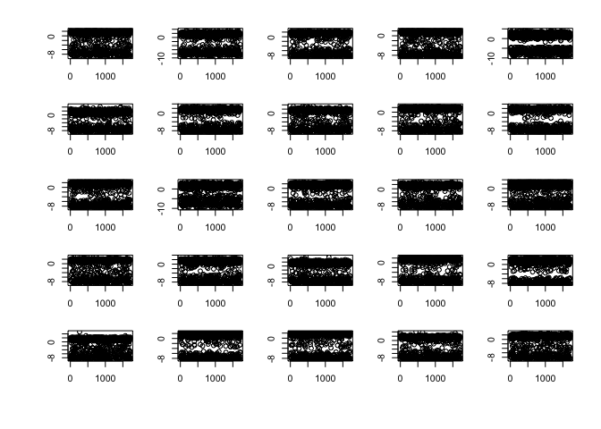
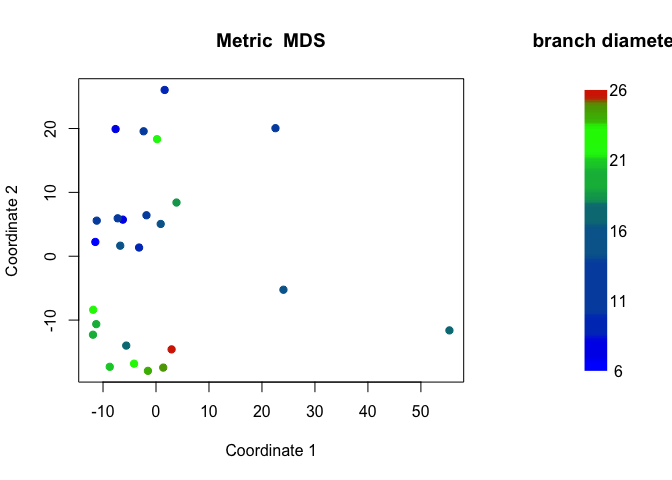

EpiRAD analysis
================

This script reads in a text file derived from the .vcf output from ipyrad. Base counts (read counts) are used for analysis of EpiRADseq data. The Jupyter notebook "VCF\_readcounts.ipynb" is used to generate the file "data3-2.txt" that is used in this script.
------------------------------------------------------------------------------------------------------------------------------------------------------------------------------------------------------------------------------------------------------------------

Read in data file

``` r
data <- read.delim("data3-2.txt", header=FALSE)
```

Since the base counts were split into four columns, these need to be summed.

``` r
data2 <- t(sapply(seq(4,ncol(data), by=4), function(i) {
     indx <- i:(i+3)
     rowSums(data[indx[indx <= ncol(data)]])}))
```

The resulting file needs to be transposed and turned into a dataframe.

``` r
data3 <- as.data.frame(t(data2))
#Add column with locus number (CHROM from .vcf file)
locus <- data[,1]
row.names(data3) <- locus
#Add header names
header <- read.delim("header_data3.txt", header=FALSE)
names <- as.vector(t(header))
colnames(data3) <- names
```

Select samples of interest (some have very low sample sizes)

``` r
data4 <- data3[,c(3,4,5,6,7,8,9,10,11,12,13,14,15,16,17,18,19,20,
                  24,25,26,27,28,29,30,31,32,33,35,36,37,38,39,40,
                  41,42,43,44,45,46,47,48,49,50,51,52,53,54,55,56)]
```

Remove ddr rows that have any zeros. The premise here is that zeros in the EpiRAD dataset are informative because they may reflect methylation, but they could also relfect true absence of the locus in the library. Here the ddRAD library serves to standarize the EpiRAD library. Any zeros in the ddRAD libary are treated as absence of the locus, thereby leaving zeros in the EpiRAD library only where the locus was counted in the ddRAD library.

``` r
data5 <- data4[apply(data4[c(1,3,5,7,9,11,13,15,17,19,21,23,25,27,29,
                             31,33,35,37,39,41,43,45,47,49)],1,
                     function(z) !any(z==0)),] 
```

Use edgeR package to standardize count data by library size

``` r
library("edgeR")
```

    ## Loading required package: limma

``` r
#read in the file to edgeR
counts <- DGEList(counts=data5)
counts$samples
```

    ##         group lib.size norm.factors
    ## 103_ddr     1   442712            1
    ## 103_epi     1   396776            1
    ## 104_ddr     1   335120            1
    ## 104_epi     1   124838            1
    ## 105_ddr     1   660000            1
    ## 105_epi     1   269819            1
    ## 106_ddr     1   606292            1
    ## 106_epi     1   460924            1
    ## 107_ddr     1    68884            1
    ## 107_epi     1    54392            1
    ## 108_ddr     1   201863            1
    ## 108_epi     1   122136            1
    ## 109_ddr     1   194994            1
    ## 109_epi     1   126115            1
    ## 110_ddr     1   514972            1
    ## 110_epi     1   247177            1
    ## 111_ddr     1   405787            1
    ## 111_epi     1   376859            1
    ## 114_ddr     1   116972            1
    ## 114_epi     1   146074            1
    ## 115_ddr     1   209149            1
    ## 115_epi     1   228996            1
    ## 116_ddr     1   181422            1
    ## 116_epi     1   110136            1
    ## 117_ddr     1   263130            1
    ## 117_epi     1   190879            1
    ## 118_ddr     1   608940            1
    ## 118_epi     1   288436            1
    ## 121_ddr     1   303112            1
    ## 121_epi     1   243347            1
    ## 122_ddr     1   518991            1
    ## 122_epi     1   309400            1
    ## 123_ddr     1   416921            1
    ## 123_epi     1   176464            1
    ## 124_ddr     1   203666            1
    ## 124_epi     1   156142            1
    ## 125_ddr     1   200056            1
    ## 125_epi     1   287056            1
    ## 126_ddr     1   238767            1
    ## 126_epi     1   237343            1
    ## 127_ddr     1   394101            1
    ## 127_epi     1   630145            1
    ## 128_ddr     1   381140            1
    ## 128_epi     1   252688            1
    ## 129_ddr     1   289423            1
    ## 129_epi     1   358438            1
    ## 130_ddr     1   295653            1
    ## 130_epi     1   206315            1
    ## 131_ddr     1   275132            1
    ## 131_epi     1   318148            1

``` r
#TMM normalization (corrects for library size)
counts2 <- calcNormFactors(counts)
counts2$samples
```

    ##         group lib.size norm.factors
    ## 103_ddr     1   442712    0.8925937
    ## 103_epi     1   396776    1.0859511
    ## 104_ddr     1   335120    0.9237280
    ## 104_epi     1   124838    1.1238390
    ## 105_ddr     1   660000    0.9525794
    ## 105_epi     1   269819    1.1459044
    ## 106_ddr     1   606292    0.8832802
    ## 106_epi     1   460924    1.1185696
    ## 107_ddr     1    68884    0.9333807
    ## 107_epi     1    54392    1.1633172
    ## 108_ddr     1   201863    0.9664427
    ## 108_epi     1   122136    1.1007253
    ## 109_ddr     1   194994    0.9047893
    ## 109_epi     1   126115    1.1111878
    ## 110_ddr     1   514972    0.9367549
    ## 110_epi     1   247177    1.0991543
    ## 111_ddr     1   405787    0.8947460
    ## 111_epi     1   376859    1.0755797
    ## 114_ddr     1   116972    0.9150063
    ## 114_epi     1   146074    1.1312853
    ## 115_ddr     1   209149    0.8472949
    ## 115_epi     1   228996    1.0923957
    ## 116_ddr     1   181422    0.8566183
    ## 116_epi     1   110136    1.0214260
    ## 117_ddr     1   263130    0.9091300
    ## 117_epi     1   190879    1.0966764
    ## 118_ddr     1   608940    0.9364274
    ## 118_epi     1   288436    1.0521285
    ## 121_ddr     1   303112    0.8885780
    ## 121_epi     1   243347    1.0088832
    ## 122_ddr     1   518991    0.9470566
    ## 122_epi     1   309400    1.1500858
    ## 123_ddr     1   416921    0.8939339
    ## 123_epi     1   176464    1.0885458
    ## 124_ddr     1   203666    0.9422270
    ## 124_epi     1   156142    1.0693963
    ## 125_ddr     1   200056    0.9090759
    ## 125_epi     1   287056    1.1197744
    ## 126_ddr     1   238767    0.8487765
    ## 126_epi     1   237343    1.1598737
    ## 127_ddr     1   394101    0.9029445
    ## 127_epi     1   630145    1.1169128
    ## 128_ddr     1   381140    0.8734733
    ## 128_epi     1   252688    1.1388224
    ## 129_ddr     1   289423    0.8629762
    ## 129_epi     1   358438    1.1507526
    ## 130_ddr     1   295653    0.9121792
    ## 130_epi     1   206315    1.1128988
    ## 131_ddr     1   275132    0.9267293
    ## 131_epi     1   318148    1.0813621

``` r
#extract normalized counts
counts2_cpm <- cpm(counts2, normalized.lib.sizes=TRUE, log=TRUE)
```

Plots to show ddRAD vs EpiRAD library (before normalization)

``` r
par(mfrow = c(5, 5))
par(mar = c(2, 2 ,2 ,2), oma = c(4, 4, 0.5, 0.5))

for (i in seq(1,49, by = 2)){
  plot(data5[,i], data5[,i+1], main = colnames(data5[i]))
}
```

<!-- -->

Plot normalized counts

``` r
par(mfrow = c(5, 5))
par(mar = c(2, 2 ,2 ,2), oma = c(4, 4, 0.5, 0.5)) 

for (i in seq(1,49, by = 2)){
  plot(counts2_cpm[,i], counts2_cpm[,i+1], main = colnames(counts2_cpm[i]))
}
```

<!-- -->

Using lm to get residuals

``` r
models <- list()
for (i in seq(1,49, by = 2)){
  models[[colnames(counts2_cpm)[i]]] <- lm(counts2_cpm[,i+1] ~ counts2_cpm[,i])
}

residuals <- lapply(models, '[[', 2)
resid_all <- as.data.frame(residuals)  
```

Plot residuals

``` r
par(mfrow = c(5, 5))
par(mar = c(2, 2 ,2 ,2), oma = c(4, 4, 0.5, 0.5)) 

for (i in 1:25){
  plot(resid_all[,i])
}
```

<!-- -->

Read in sample info

``` r
sinfo <- read.table("sample_info.txt", colClasses = 'character', header = FALSE)
#without sample 101 and 112
sinfo2 <- sinfo[c(2:10,12:27),]
#transpose
tsinfo <- t(sinfo2)
#create vectors for morphotype and diameter (note whether sample 101
#was included or not)
type <- tsinfo[3,]
diam <- tsinfo[5,]
```

MDS

``` r
resid_t <- t(resid_all)
d <- dist(resid_t) # euclidean distances between the rows
fit <- cmdscale(d,eig=TRUE, k=2)
x <- fit$points[,1]
y <- fit$points[,2]
```

This adds a vector of color values based on the diam values

``` r
data_seq = seq(min(as.numeric(diam)), max(as.numeric(diam)), length=25)
col_pal = colorRampPalette(c('blue', 'green', 'red'))(25+1)
cols = col_pal[ cut(as.numeric(diam), data_seq, include.lowest=T) ]
```

Plot it

``` r
layout(matrix(1:2,ncol=2), width = c(3,1),height = c(1,1))
plot(x, y, xlab="Coordinate 1", ylab="Coordinate 2", 
     main="Metric  MDS",  type="n")
points(x,y, col = cols, pch = 19)

legend_image <- as.raster(matrix(sort(cols, decreasing = TRUE), ncol=1))
plot(c(0,2),c(0,1),type = 'n', axes = F,xlab = '', ylab = '', main = 'branch diameter')
text(x=1.5, y = seq(0,1,l=5), labels = seq(6,26,l=5))
rasterImage(legend_image, 0, 0, 1,1)
```

<!-- -->

PCA

``` r
pca <- prcomp(resid_t)
summary(pca)
```

    ## Importance of components:
    ##                             PC1      PC2      PC3     PC4      PC5
    ## Standard deviation     14.70578 13.77914 13.18615 12.7197 11.98325
    ## Proportion of Variance  0.08996  0.07898  0.07233  0.0673  0.05973
    ## Cumulative Proportion   0.08996  0.16894  0.24127  0.3086  0.36831
    ##                             PC6     PC7      PC8      PC9    PC10    PC11
    ## Standard deviation     11.61985 10.9305 10.72443 10.30644 9.97504 9.75921
    ## Proportion of Variance  0.05617  0.0497  0.04784  0.04419 0.04139 0.03962
    ## Cumulative Proportion   0.42447  0.4742  0.52202  0.56620 0.60759 0.64721
    ##                           PC12    PC13    PC14    PC15    PC16    PC17
    ## Standard deviation     9.44744 9.05958 8.87081 8.74072 8.46252 8.26990
    ## Proportion of Variance 0.03713 0.03414 0.03273 0.03178 0.02979 0.02845
    ## Cumulative Proportion  0.68434 0.71848 0.75122 0.78300 0.81279 0.84124
    ##                           PC18    PC19    PC20    PC21    PC22    PC23
    ## Standard deviation     8.13885 7.85625 7.80733 7.35959 7.15391 6.66226
    ## Proportion of Variance 0.02756 0.02567 0.02536 0.02253 0.02129 0.01846
    ## Cumulative Proportion  0.86879 0.89447 0.91982 0.94236 0.96364 0.98211
    ##                           PC24      PC25
    ## Standard deviation     6.55826 1.082e-14
    ## Proportion of Variance 0.01789 0.000e+00
    ## Cumulative Proportion  1.00000 1.000e+00

``` r
eig <- (pca$sdev)^2

#plot
biplot(pca)
```

    ## Warning in arrows(0, 0, y[, 1L] * 0.8, y[, 2L] * 0.8, col = col[2L], length
    ## = arrow.len): zero-length arrow is of indeterminate angle and so skipped

    ## Warning in arrows(0, 0, y[, 1L] * 0.8, y[, 2L] * 0.8, col = col[2L], length
    ## = arrow.len): zero-length arrow is of indeterminate angle and so skipped

<!-- -->

Make binary dataset based on residuals \<=-1

``` r
resid_all_binary <- ifelse(resid_all<=-1, 1, 0)
```

Proportion of methylated cutsites

``` r
prop_methyl <- colSums(resid_all_binary) / nrow(resid_all_binary)
dens <- density(prop_methyl)
plot(dens)
```

<!-- -->

Get only rows that are differentially methylated

``` r
resid1 <- resid_all_binary[rowSums(resid_all_binary) < 25, ]
resid2 <- resid1[rowSums(resid1) >= 1, ]
```

MDS with binary (methylated vs unmethylated) data

``` r
resid_t_binary <- t(resid2)
d <- dist(resid_t_binary) # euclidean distances between the rows
fit <- cmdscale(d,eig=TRUE, k=2)
x <- fit$points[,1]
y <- fit$points[,2]
```

This adds a column of color values based on the y values

``` r
data_seq = seq(min(as.numeric(diam)), max(as.numeric(diam)), length=25)
col_pal = colorRampPalette(c('blue', 'green', 'red'))(25+1)
cols = col_pal[ cut(as.numeric(diam), data_seq, include.lowest=T) ]
```

Plot MDS

``` r
layout(matrix(1:2,ncol=2), width = c(3,1),height = c(1,1))
plot(x, y, xlab="Coordinate 1", ylab="Coordinate 2", 
         main="Metric  MDS",  type="n")
points(x,y, col = cols, pch = 19)

legend_image <- as.raster(matrix(sort(cols, decreasing = TRUE), ncol=1))
plot(c(0,2),c(0,1),type = 'n', axes = F,xlab = '', ylab = '', main = 'legend title')
text(x=1.5, y = seq(0,1,l=5), labels = seq(6,26,l=5))
rasterImage(legend_image, 0, 0, 1,1)
```

<!-- -->

Heatmap of binary data

``` r
heatmap(resid_t_binary, scale = "none")
```

<!-- -->
