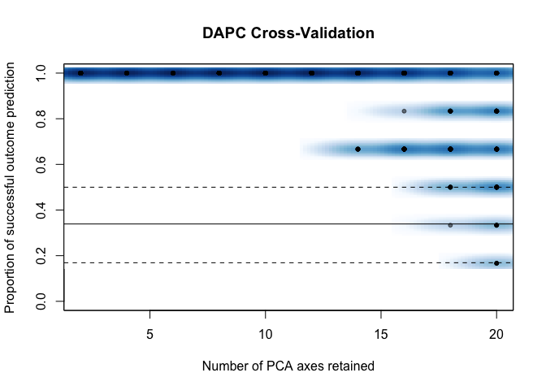
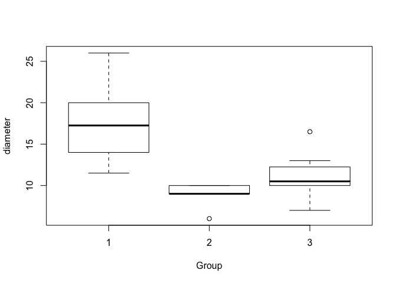
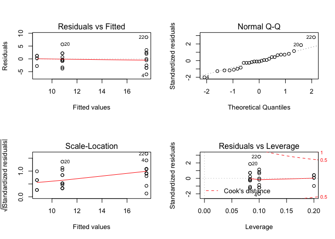
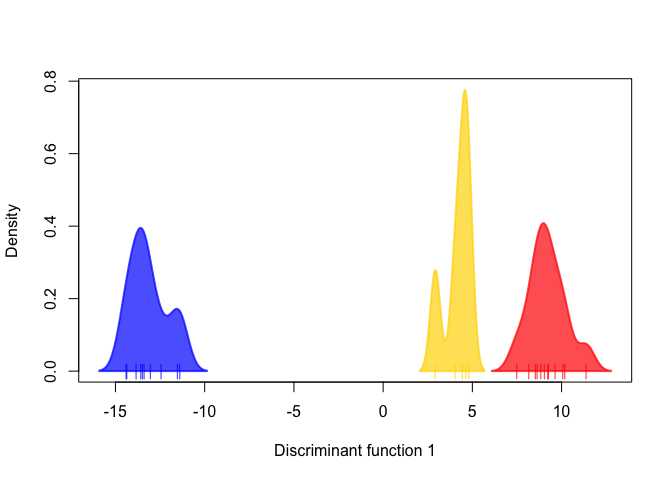

ddRAD\_analysis
================

This script reads in data files from the ipyrad output and subsets the data to get only ddRAD data and extract only SNPs without missing data.
==============================================================================================================================================

Set directory and read in .str datafile from iPyrad output. This is the unlinked SNPs file.

``` r
data2.2 <- read.delim("data3.u.str", header=FALSE)
data <- data2.2[,colSums(is.na(data2.2))<nrow(data2.2)]
```

Vector of unlinked SNP IDs corresponding to data3.snps.map

``` r
unlinkedsnps <- seq(c(1:11822))
data2 <- data[,2:11823]
colnames(data2) <- unlinkedsnps
data3 <- cbind(data[,1],data2)
data4 <- t(data3)
data5 <- as.data.frame(data4)
```

Extract only ddRAD data

``` r
data6 <- data5[,c(1,2,5,6,9,10,13,14,17,18,21,22,25,26,29,30,33,34,37,38,41,42,47,48,51,52,55,56,59,60,63,64,69,70,73,74,77,78,81,82,85,86,89,90,93,94,97,98,101,102,105,106,109,110)]
```

Remove any SNPs with missing data (-9 is the NA value)

``` r
data7 <- data6[!rowSums(data6 == -9) >= 1,]
data8 <-t(data7)
rownames(data8) <- data8[,1]
data9 <- data8[,2:1114]
write.table(data9, file = "data3-2.str", row.names = TRUE, col.names = TRUE, quote = FALSE)
```

Read in a .geno file from the ipyrad output and extract ddRAD data without missing values. This is the best filetype for MDS.

``` r
a1 <- read.table("data3.u.geno", colClasses = 'character', header = FALSE)
a2 <- read.fwf("data3.u.geno", widths=rep(1, max(nchar(a1$V1))), colClasses = 'numeric', header=FALSE)
header <- read.delim("header_data3.txt", header=FALSE)
names <- t(header)
names2 <-as.vector(names)
colnames(a2) <- names2
```

Select samples of interest (some have very low sample sizes)

``` r
a3 <- a2[,c(1,3,4,5,6,7,8,9,10,11,12,13,14,15,16,17,18,19,20,21,22,24,25,26,27,28,29,30,31,32,33,35,36,37,38,39,40,41,42,43,44,45,46,47,48,49,50,51,52,53,54,55,56)]
```

Matrix with only ddr loci \*\*if including sample 101

``` r
a4 <- a3[,c(1,2,4,6,8,10,12,14,16,18,20,22,24,26,28,30,32,34,36,38,40,42,44,46,48,50,52)]
```

Get rid of rows with any NAs (9)

``` r
a5 <- a4[!rowSums(a4 == 9) >= 1,]
head(a5)
```

    ##    101_ddr 103_ddr 104_ddr 105_ddr 106_ddr 107_ddr 108_ddr 109_ddr 110_ddr
    ## 3        2       2       2       2       2       2       2       2       2
    ## 14       2       2       2       2       1       1       2       2       1
    ## 26       2       2       2       2       2       2       2       0       2
    ## 47       2       2       2       2       2       2       2       2       2
    ## 49       0       2       0       1       0       2       2       2       2
    ## 81       2       2       2       2       2       2       2       2       2
    ##    111_ddr 112_ddr 114_ddr 115_ddr 116_ddr 117_ddr 118_ddr 121_ddr 122_ddr
    ## 3        2       2       2       1       2       2       2       2       2
    ## 14       2       2       2       1       2       2       2       2       2
    ## 26       2       2       0       2       2       2       0       0       2
    ## 47       2       2       2       2       2       2       1       2       2
    ## 49       1       2       2       2       2       2       2       2       2
    ## 81       2       2       2       2       2       2       2       2       1
    ##    123_ddr 124_ddr 125_ddr 126_ddr 127_ddr 128_ddr 129_ddr 130_ddr 131_ddr
    ## 3        2       2       2       2       2       2       2       2       2
    ## 14       2       1       2       2       1       2       2       2       2
    ## 26       2       2       2       2       2       2       2       2       2
    ## 47       2       2       2       2       2       2       2       2       2
    ## 49       2       2       2       2       2       2       2       2       2
    ## 81       2       2       2       2       2       2       2       2       2

Read in sample info and transpose. Columns are sample, depth, type, symbiont type, and branch diamater.

``` r
sinfo <- read.table("sample_info.txt", colClasses = 'character', header = FALSE)
head(sinfo)
```

    ##    V1   V2   V3   V4   V5
    ## 1 101  7.9 Ppor    C 19.5
    ## 2 103 16.2 Pfur    C 10.5
    ## 3 104 16.5 Pfur    C    9
    ## 4 105  9.8 Pfur <NA> 11.5
    ## 5 106  7.0 Pfur    C   17
    ## 6 107 12.5 Pfur <NA> 11.5

``` r
tsinfo <- t(sinfo)
```

Create vectors for morphotype and diameter (note whether sample 101 was included or not)

``` r
type <- tsinfo[3,]
diam <- tsinfo[5,]
```

MDS of SNPs

``` r
a6 <- t(a5)
d <- dist(a6) # euclidean distances between the rows
fit <- cmdscale(d,eig=TRUE, k=2)
x <- fit$points[,1]
y <- fit$points[,2]
```

This adds a column of color values based on branch diameter

``` r
data_seq = seq(min(as.numeric(diam)), max(as.numeric(diam)), length=25)
col_pal = colorRampPalette(c('blue', 'green', 'red'))(25+1)
cols = col_pal[ cut(as.numeric(diam), data_seq, include.lowest=T) ]
```

Plot MDS and legend

``` r
layout(matrix(1:2,ncol=2), width = c(3,1),height = c(1,1))
plot(x, y, xlab="Coordinate 1", ylab="Coordinate 2", 
     main="MDS colored by branch diameter",  type="n")
points(x,y, col = cols, pch = 19)

legend_image <- as.raster(matrix(sort(cols, decreasing = TRUE), ncol=1))
plot(c(0,2),c(0,1),type = 'n', axes = F,xlab = '', ylab = '', main = 'branch diamater')
text(x=1.5, y = seq(0,1,l=5), labels = seq(6,26,l=5))
rasterImage(legend_image, 0, 0, 1,1)
```

<!-- -->

DAPC using adegenet

``` r
library("adegenet")
library("ade4")
```

Read in unlinked SNP file created at the top of this script.

``` r
genind1 <- read.structure("data3-2.str", n.ind = 27, n.loc = 1113, 
                          onerowperind = FALSE, col.lab = 1, 
                          NA.char = "-9", ask = FALSE, 
                          row.marknames = 1, quiet = FALSE)
```

    ## 
    ##  Converting data from a STRUCTURE .stru file to a genind object...

Find optimal number of clusters irrespective of species id. In this case, best to retain all PCs.

``` r
groups <- find.clusters(genind1, max.n.clust=10, n.pca = 24,
                        choose.n.clust = FALSE, criterion = "min")
```

Cross validation to determine number of PCs to retain.

``` r
xval <- xvalDapc(genind1@tab, groups$grp, n.pca.max = 25, training.set  = 0.9,result = "groupMean", center = TRUE, scale = FALSE,n.pca = NULL, n.rep = 100, xval.plot = TRUE)
```

<!-- -->

Show max number of PCs to retain

``` r
xval[2:6]
```

    ## $`Median and Confidence Interval for Random Chance`
    ##      2.5%       50%     97.5% 
    ## 0.1690278 0.3388889 0.5000000 
    ## 
    ## $`Mean Successful Assignment by Number of PCs of PCA`
    ##         2         4         6         8        10        12        14 
    ## 1.0000000 1.0000000 1.0000000 1.0000000 1.0000000 1.0000000 0.9733333 
    ##        16        18        20 
    ## 0.9216667 0.8550000 0.7466667 
    ## 
    ## $`Number of PCs Achieving Highest Mean Success`
    ## [1] "2"
    ## 
    ## $`Root Mean Squared Error by Number of PCs of PCA`
    ##         2         4         6         8        10        12        14 
    ## 0.0000000 0.0000000 0.0000000 0.0000000 0.0000000 0.0000000 0.0942809 
    ##        16        18        20 
    ## 0.1607275 0.2291288 0.3480102 
    ## 
    ## $`Number of PCs Achieving Lowest MSE`
    ## [1] "12"

Perform dapc using groups defined above group (groups$grp). Note that n.pca and n.da can be left blank and the program will query which values to choose.

``` r
dapc1 <- dapc(genind1, pop = groups$grp, n.pca=9, n.da=2)
```

Scatterplot of results

``` r
scatter(dapc1, #label.inds = list(air = 0.05, pch = 0.5),
        posi.da = "topleft", posi.pca = "topright")
```

<!-- -->

Look at loadings of individual loci

``` r
set.seed(4)
contrib <- loadingplot(dapc1$var.contr, axis=1, 
                       thres=.005, lab.jitter=1)
```

<!-- -->

Boxplot comparing branch diameter among groups from dapc

``` r
diam2 <- as.numeric(sinfo[,5])
boxplot(diam2 ~ dapc1$assign, xlab = "Group", ylab =  "diameter")
```

<!-- -->

ANOVA of diameter by group

``` r
#Run lm on diameter by group
model <- lm(diam2 ~ dapc1$assign)
#Check model (qq plot, etc)
par(mfrow=c(2,2))
plot(model)
```

<!-- -->

``` r
library(lmtest)
```

    ## Loading required package: zoo

    ## 
    ## Attaching package: 'zoo'

    ## The following objects are masked from 'package:base':
    ## 
    ##     as.Date, as.Date.numeric

``` r
#Breush Pagan Test for heteroscadisticity
bpt <- bptest(model)
print(bpt)
```

    ## 
    ##  studentized Breusch-Pagan test
    ## 
    ## data:  model
    ## BP = 3.724, df = 2, p-value = 0.1554

``` r
#Run ANOVA
aov <- anova(model)
print(summary(aov))
```

    ##        Df           Sum Sq         Mean Sq          F value     
    ##  Min.   : 2.0   Min.   :242.7   Min.   : 10.11   Min.   :17.38  
    ##  1st Qu.: 7.5   1st Qu.:269.9   1st Qu.: 51.52   1st Qu.:17.38  
    ##  Median :13.0   Median :297.1   Median : 92.92   Median :17.38  
    ##  Mean   :13.0   Mean   :297.1   Mean   : 92.92   Mean   :17.38  
    ##  3rd Qu.:18.5   3rd Qu.:324.3   3rd Qu.:134.33   3rd Qu.:17.38  
    ##  Max.   :24.0   Max.   :351.5   Max.   :175.74   Max.   :17.38  
    ##                                                  NA's   :1      
    ##      Pr(>F)        
    ##  Min.   :2.16e-05  
    ##  1st Qu.:2.16e-05  
    ##  Median :2.16e-05  
    ##  Mean   :2.16e-05  
    ##  3rd Qu.:2.16e-05  
    ##  Max.   :2.16e-05  
    ##  NA's   :1

``` r
#pairwise t test with bonferonni adjustment
ttest <- pairwise.t.test(diam2, dapc1$assign, p.adj = "bonf")
print(ttest)
```

    ## 
    ##  Pairwise comparisons using t tests with pooled SD 
    ## 
    ## data:  diam2 and dapc1$assign 
    ## 
    ##   1       2      
    ## 2 0.00012 -      
    ## 3 0.00015 0.72411
    ## 
    ## P value adjustment method: bonferroni

Multiple regression: test linear model of depth, symbiont type, and branch diameter vs. dapc of SNPs using a single DA from the model above

``` r
#dapc with single DF
dapc1 <- dapc(genind1, pop = groups$grp, n.pca=9, n.da=1)
#Select # pcs = 9, # df = 1
scatter(dapc1)
```

<!-- -->

``` r
#convert DF coord to vector
dapc1_da1 <- dapc1$ind.coord
#replace unknown symbiont type NAs to "U"
sinfo[is.na(sinfo)] <- "U"
#fit model with water depth (sinfo$V2), branch diameter (sinfo$V5), 
# and symbiont type (sinfo$V4) 
fit <- lm(na.omit(dapc1_da1 ~ as.numeric(sinfo$V2) + as.factor(sinfo$V4) + as.numeric(sinfo$V5)))
#Relative importance of different variables in model
library(relaimpo)
```

    ## Loading required package: MASS

    ## Loading required package: boot

    ## Loading required package: survey

    ## Loading required package: grid

    ## 
    ## Attaching package: 'survey'

    ## The following object is masked from 'package:graphics':
    ## 
    ##     dotchart

    ## Loading required package: mitools

    ## This is the global version of package relaimpo.

    ## If you are a non-US user, a version with the interesting additional metric pmvd is available

    ## from Ulrike Groempings web site at prof.beuth-hochschule.de/groemping.

``` r
relimp <- calc.relimp(fit,type=c("lmg","last","first"),
            rela=TRUE)
print(relimp)
```

    ## Response variable: dapc1_da1 
    ## Total response variance: 109.8436 
    ## Analysis based on 27 observations 
    ## 
    ## 4 Regressors: 
    ## Some regressors combined in groups: 
    ##         Group  as.factor(sinfo$V4) : `as.factor(sinfo$V4)`C `as.factor(sinfo$V4)`U 
    ## 
    ##  Relative importance of 3 (groups of) regressors assessed: 
    ##  as.factor(sinfo$V4) as.numeric(sinfo$V2) as.numeric(sinfo$V5) 
    ##  
    ## Proportion of variance explained by model: 56.27%
    ## Metrics are normalized to sum to 100% (rela=TRUE). 
    ## 
    ## Relative importance metrics: 
    ## 
    ##                              lmg        last      first
    ## as.factor(sinfo$V4)  0.115804851 0.060661715 0.15939394
    ## as.numeric(sinfo$V2) 0.007478066 0.001482407 0.01444049
    ## as.numeric(sinfo$V5) 0.876717084 0.937855878 0.82616557
    ## 
    ## Average coefficients for different model sizes: 
    ## 
    ##                            1group     2groups     3groups
    ## as.numeric(sinfo$V2)   -0.1595403 -0.08809287 -0.04820327
    ## `as.factor(sinfo$V4)`C -5.4960072 -4.10760831 -2.96670323
    ## `as.factor(sinfo$V4)`U  2.3897158  2.03950577  1.45193057
    ## as.numeric(sinfo$V5)   -1.5961765 -1.55308869 -1.51503201
